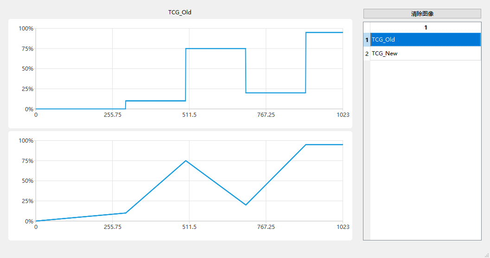
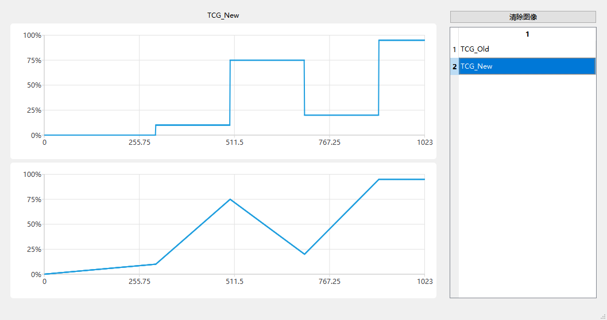
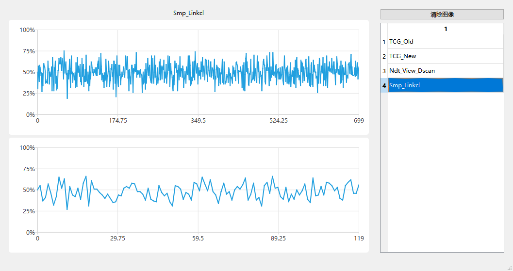

[TCG_Old](#TCG_Old)

[TCG_NEW](#TCG_NEW)

[Smp_Linkcl](#Smp_Linkcl)

# TCG_Old


# TCG_NEW

```c++
    auto points = 1024;
    std::vector<double> deps = {300, 500, 700, 900};
    std::vector<double> gains = {10, 75, 20, 95};
```





## Smp_Linkcl

