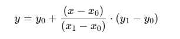

## ✅ 线性插值主要步骤

------

### **🧮 步骤 1：准备数据点**

你需要一组已知的点，通常是 `(x, y)` 对应关系，在你的例子中是：

```cpp
std::vector<double> deps = {0, 25, 50, 75, 100};    // 这是 x 值（深度）
std::vector<double> gains = {0, 10, 15, 20, 15};    // 这是 y 值（增益）
```

这些是**关键点**（known anchor points），我们希望在它们之间插值出更平滑的结果。

------

### **📏 步骤 2：决定插值范围和精度**

我们决定要插值出多少个点：

```cpp
int total_points = 100;
```

这意味着我们希望在 x 从 `0` 到 `100` 的范围内生成 100 个点，形成更平滑的曲线。

------

### **🔍 步骤 3：遍历每个目标 x 值，找到其所在区间**

对于每一个插值目标点 `xi`，我们要找出它在哪两个已知点 `(x[k], x[k+1])` 之间。

这一步是：

```cpp
auto upper = std::upper_bound(x.begin(), x.end(), xi);
int idx = std::distance(x.begin(), upper) - 1;
```

`std::upper_bound`, 在一个**已排序的范围**中，查找**第一个“大于某个值”的元素位置**。

`std::distance`返回两个迭代器之间的距离（可以看成是“索引差”）。

比如：

- `xi = 42`，它就落在 `x[1]=25` 和 `x[2]=50` 之间。

------

### **📈 步骤 4：使用线性插值公式计算对应 y 值**

找到了区间之后，使用线性插值公式：



在代码里就是：

```cpp
double yi = y0 + (y1 - y0) * (xi - x0) / (x1 - x0);
```

这一步就是“插值”的核心计算。

------

### **📝 步骤 5：保存插值结果**

把 `(xi, yi)` 加入到结果列表：

```cpp
result.append(QPointF(xi, yi));
```

这样所有插值点就被依次保存下来，最终返回给你用于图形显示。

------

## 🔚 总结：线性插值五步法

| 步骤 | 内容                                             |
| ---- | ------------------------------------------------ |
| 1️⃣    | 准备已知点 `x[]` 和 `y[]`                        |
| 2️⃣    | 决定插值的精度（点数或步长）                     |
| 3️⃣    | 对每个新 `xi`，定位落在哪段区间 `(x[k], x[k+1])` |
| 4️⃣    | 用公式插出 `yi`                                  |
| 5️⃣    | 存储插值点 `(xi, yi)`                            |

